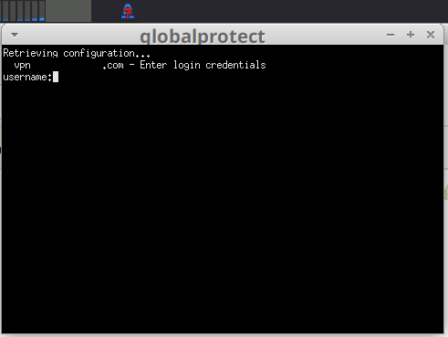

# Simple GlobalProtectGUI
 
GlobalProtectGUI is simple tray app to connect, disconnect and monitor 
globalprotect VPN connection.

## Installation

Required before starting script:
```
pip3 install pgi
sudo apt install gir1.2-appindicator3
sudo apt install xterm
```

Clone this repo and run globalprotect-gui.py and tray icon will appear.

To run this on start you can setup  ~/.config/autostart/*.desktop (the XDG Autostart specification), 
or through ~/.xprofile (a regular shell script),
e.g.
`sudo vi ~/.config/autostart/globalprotect-gui.desktop`
with content:
```
[Desktop Entry]
Name=GlobalProtectGUI
Type=Application
Exec=[PATH_TO_REPO]/globalprotect-gui.py
X-GNOME-Autostart-Delay=60
```
# Preview

### Connected:


### Disconnected:


### Dropdown:


### Connecting:
